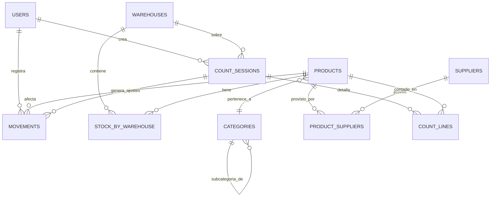

# Modelo de datos

## Principio central: el stock es un ledger

El stock **no** es un número que se edita. Es la consecuencia de un registro de
movimientos inmutables (`movements`). El stock actual por bodega se guarda
materializado en `stock_by_warehouse` y se actualiza **en la misma transacción**
que inserta el movimiento. Esto da trazabilidad (M-08) casi gratis y hace natural
la conciliación del conteo físico (M-06).

Regla de oro: **toda escritura de stock pasa por el servicio de movimientos.**
Ningún endpoint modifica `stock_by_warehouse` por su cuenta.

## Enums

- `Role`: `JEFE`, `GESTOR`
- `MovementType`: `ENTRADA`, `SALIDA`, `TRANSFERENCIA`
- `MovementReason`: `COMPRA`, `DEVOLUCION_CLIENTE`, `AJUSTE_POSITIVO`,
  `DESPACHO`, `DEVOLUCION_PROVEEDOR`, `AJUSTE_NEGATIVO`, `MERMA`,
  `TRANSFERENCIA`, `CONTEO_FISICO`
- `UnitOfMeasure`: `UNIDAD`, `PIEZA`, `METRO`, `KIT`, … (extensible)
- `CountSessionStatus`: `EN_PROGRESO`, `PENDIENTE_APROBACION`, `APROBADA`, `CANCELADA`

Los "ajustes" no son un tipo aparte: un ajuste positivo es una `ENTRADA` con motivo
`AJUSTE_POSITIVO` (o `CONTEO_FISICO`); un ajuste negativo es una `SALIDA` con motivo
`AJUSTE_NEGATIVO` (o `CONTEO_FISICO`).

## Diagrama entidad-relación



## Entidades

### users
`id` (uuid, PK) · `name` · `email` (único) · `password_hash` · `role` (Role) ·
`active` (bool, default true) · `created_at` · `updated_at`

### warehouses
`id` (uuid, PK) · `name` · `location` (nullable) · `active` (bool) · `created_at`

### categories
`id` (uuid, PK) · `name` · `parent_id` (nullable, FK → categories) — para
industrial/automotriz y sus subcategorías.

### suppliers
`id` (uuid, PK) · `name` · `contact` (nullable) · `created_at`

### products
`id` (uuid, PK) · `internal_code` (único) · `supplier_code` (nullable) · `name` ·
`description` (nullable) · `category_id` (FK) · `unit` (UnitOfMeasure) ·
`min_stock` (int, default 0) · `cost_price` (**Decimal**, nullable — dato
financiero, oculto al `GESTOR`) · `active` (bool) · `created_at` · `updated_at`

### product_suppliers
`product_id` (FK) · `supplier_id` (FK) — PK compuesta. Relación N-a-N.

### stock_by_warehouse  (stock actual materializado)
`product_id` (FK) · `warehouse_id` (FK) · `quantity` (int, default 0,
`CHECK quantity >= 0`) · `updated_at` — PK (`product_id`, `warehouse_id`).

### movements  (ledger append-only)
`id` (uuid, PK) · `type` (MovementType) · `reason` (MovementReason) ·
`product_id` (FK) · `quantity` (int, > 0) · `from_warehouse_id` (nullable, FK) ·
`to_warehouse_id` (nullable, FK) · `reference` (nullable) · `user_id` (FK) ·
`count_session_id` (nullable, FK) · `created_at`

Índices sugeridos: (`product_id`, `created_at`), (`created_at`), (`user_id`).

Semántica de bodegas por tipo:
- `ENTRADA`: `to_warehouse_id` obligatorio, `from` nulo. Suma al destino.
- `SALIDA`: `from_warehouse_id` obligatorio, `to` nulo. Resta del origen.
- `TRANSFERENCIA`: ambos obligatorios. Resta del origen y suma al destino en una
  sola transacción.

### count_sessions
`id` (uuid, PK) · `warehouse_id` (FK) · `status` (CountSessionStatus) ·
`created_by` (FK → users) · `approved_by` (nullable, FK → users) · `created_at` ·
`approved_at` (nullable) · `note` (nullable)

### count_lines
`id` (uuid, PK) · `count_session_id` (FK) · `product_id` (FK) ·
`theoretical_qty` (int — snapshot al iniciar) · `counted_qty` (int, nullable) ·
`difference` (int, calculado = `counted_qty - theoretical_qty`) —
único (`count_session_id`, `product_id`).

### access_logs  (auditoría de accesos — req. 6.2)
`id` · `user_id` (nullable) · `action` (ej. `LOGIN`, `LOGOUT`, `LOGIN_FAILED`) ·
`ip` (nullable) · `created_at`

## Reglas transaccionales (cómo aplicar un movimiento)

Toda aplicación de movimiento ocurre en **una transacción**:

1. Bloquear la(s) fila(s) de `stock_by_warehouse` afectadas (`SELECT … FOR UPDATE`).
2. Para `SALIDA` / `TRANSFERENCIA`: verificar `quantity <= stock_origen`. Si no,
   abortar con `InsufficientStockError`.
3. Insertar la fila en `movements`.
4. Actualizar `stock_by_warehouse` (upsert): destino `+= quantity`, origen `-= quantity`.

El lock de fila serializa escrituras concurrentes sobre el mismo producto/bodega y
garantiza que el stock nunca quede negativo, incluso con usuarios simultáneos.

## Conteo físico (flujo de datos)

1. Crear `count_session` (`EN_PROGRESO`) y poblar `count_lines` con
   `theoretical_qty` = snapshot del stock teórico de esa bodega.
2. El gestor ingresa `counted_qty` (puede hacerlo offline; ver el módulo de sync).
3. Al enviar, la sesión pasa a `PENDIENTE_APROBACION` y se calculan `difference`.
4. El **Jefe** aprueba → por cada `difference != 0` se genera un `movement`
   (`ENTRADA`/`SALIDA`, motivo `CONTEO_FISICO`, `count_session_id` seteado), todo en
   una transacción. La sesión pasa a `APROBADA`.
5. Si el stock teórico cambió desde el snapshot, marcar esas líneas para revisión
   antes de aplicar.

## Boceto de `schema.prisma` (referencia, no final)

```prisma
enum Role { JEFE GESTOR }
enum MovementType { ENTRADA SALIDA TRANSFERENCIA }
enum MovementReason {
  COMPRA DEVOLUCION_CLIENTE AJUSTE_POSITIVO
  DESPACHO DEVOLUCION_PROVEEDOR AJUSTE_NEGATIVO MERMA
  TRANSFERENCIA CONTEO_FISICO
}
enum CountSessionStatus { EN_PROGRESO PENDIENTE_APROBACION APROBADA CANCELADA }

model User {
  id           String   @id @default(uuid())
  name         String
  email        String   @unique
  passwordHash String
  role         Role
  active       Boolean  @default(true)
  createdAt    DateTime @default(now())
  updatedAt    DateTime @updatedAt
  movements    Movement[]
}

model Product {
  id           String   @id @default(uuid())
  internalCode String   @unique
  supplierCode String?
  name         String
  description  String?
  categoryId   String
  category     Category @relation(fields: [categoryId], references: [id])
  unit         String
  minStock     Int      @default(0)
  costPrice    Decimal? @db.Decimal(12, 2)
  active       Boolean  @default(true)
  stock        StockByWarehouse[]
  movements    Movement[]
}

model StockByWarehouse {
  productId   String
  warehouseId String
  quantity    Int      @default(0)
  updatedAt   DateTime @updatedAt
  product     Product   @relation(fields: [productId], references: [id])
  warehouse   Warehouse @relation(fields: [warehouseId], references: [id])
  @@id([productId, warehouseId])
}

model Movement {
  id              String        @id @default(uuid())
  type            MovementType
  reason          MovementReason
  productId       String
  quantity        Int
  fromWarehouseId String?
  toWarehouseId   String?
  reference       String?
  userId          String
  countSessionId  String?
  createdAt       DateTime      @default(now())
  product         Product       @relation(fields: [productId], references: [id])
  user            User          @relation(fields: [userId], references: [id])
  @@index([productId, createdAt])
  @@index([createdAt])
}
```

(Faltan `Warehouse`, `Category`, `Supplier`, `ProductSupplier`, `CountSession`,
`CountLine`, `AccessLog` y los `@relation` inversos — Claude Code los completa al
generar el schema real.)
